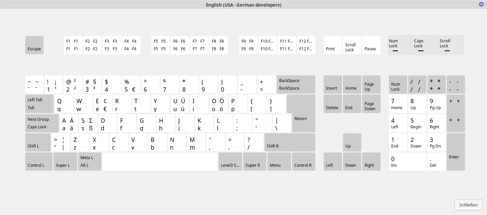

# US dev-de Keymap

This is a modified keymap for X11 which I prefer to use on my systems.

It's a US-based layout with some special characters available on the
<Alt>-key on the right side of the space bar. I call it RAlt in this
document. It may be labeled AltGr on some keyboards.

Most charachter are available by holding <RAlt> while typing another
key. E.g. <RAlt>+<a> will give you the german umlaut ä.

## German umlauts

RAlt + A, O, U  ==>  Ä, Ö, Ü

RAlt + s        ==>  ß

RAlt + e        ==>  €

## Technical stuff

RAlt + 1, 2, 3  ==>  ¹, ², ³
       
## Complete keymap

Here's the complete keymap:



## Installation

To use this keymap, run the `./install.sh` command as root

## Use it

Activate the keymap with setxkbmap:
 
```
$ setxkbmap us dev-de
```

To configure it via the GUI:

* [Gnome](https://www.mkammerer.de/blog/custom-keyboard-layouts-in-gnome/)
* [Cinnamon](https://www.mkammerer.de/blog/custom-keyboard-layouts-in-cinnamon/)
* [Xfce](https://www.mkammerer.de/blog/custom-keyboard-layouts-with-linux/)

## Credits

This is a fork from [chtaube](https://github.com/chtaube/Keymap), i just modified it a bit and added an installer.
